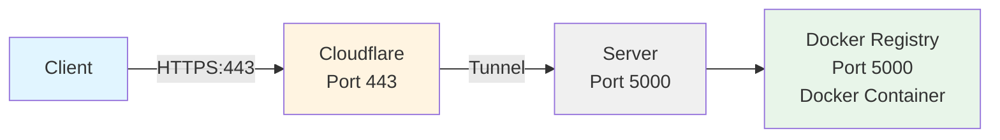

# Docker Private Registry

A simple and secure Docker private registry setup with native SSL/TLS encryption, and basic authentication. Perfect for personal use or small teams (non-enterprise grade yet)

## Features

- 🔒 **SSL/TLS Encryption** - Secure communication with self-signed certificates
- 🔐 **Basic Authentication** - Password-protected registry access
- 🚀 **Easy Setup** - Automated installation script
- 🐳 **Docker Compose** - Simple deployment and management
- 📝 **Configurable** - Environment-based configuration
- � **Full Authentication** - All operations (pull/push) require authentication

## Prerequisites

- Docker and Docker Compose installed
- `htpasswd` utility (usually comes with Apache tools)
  - macOS: `brew install httpd`
  - Ubuntu/Debian: `apt-get install apache2-utils`
  - CentOS/RHEL: `yum install httpd-tools`
- OpenSSL (usually pre-installed)

## Quick Start

### 1. Clone the Repository

```bash
git clone <your-repo-url>
cd docker-private-registry
```

### 2. Configure Environment

Copy the example environment file and configure your domain:

```bash
cp .env.example .env
```

Edit `.env` and set your registry domain:

```bash
REGISTRY_DOMAIN=registry.yourdomain.com
```

> **Note**: If you're testing locally, you can use `localhost` or create a local DNS entry.

### 3. Run Installation Script

Execute the automated installation script:

```bash
./install.sh
```

The script will:
1. ✅ Verify `.env` file exists and `REGISTRY_DOMAIN` is set
2. ✅ Generate self-signed SSL certificate (if not exists)
3. ✅ Set proper permissions on SSL files
4. ✅ Create authentication credentials with `htpasswd`
5. ✅ Start the registry with Docker Compose

### 4. Verify Installation

Check if containers are running:

```bash
docker compose ps
# or
docker-compose ps
```

You should see one container:
- `docker-registry` (Registry service)

## Usage

### Login to Registry

```bash
docker login registry.yourdomain.com:5000
```

Enter the username and password you created during installation.

### Tag and Push an Image

```bash
# Tag an existing image
docker tag myimage:latest registry.yourdomain.com:5000/myimage:latest

# Push to your private registry
docker push registry.yourdomain.com:5000/myimage:latest
```

### Pull an Image

```bash
docker pull registry.yourdomain.com:5000/myimage:latest
```

> **Note**: Both pulling and pushing require authentication. Make sure you're logged in before performing any operations.

### List Images in Registry

```bash
curl -k https://registry.yourdomain.com:5000/v2/_catalog
```

## Project Structure

```
docker-private-registry/
├── auth/                    # Authentication files
│   └── .gitignore          # Preserves folder structure
├── data/                    # Registry storage (images)
│   └── .gitignore          # Preserves folder structure
├── ssl/                     # SSL certificates
│   └── .gitignore          # Preserves folder structure
├── .env                     # Environment variables (not in git)
├── .env.example            # Example environment file
├── .gitignore              # Git ignore rules
├── config.yml              # Registry configuration
├── docker-compose.yml      # Docker Compose configuration
├── install.sh              # Automated installation script
├── LICENSE                 # License file
└── README.md              # This file
```

## Configuration

### Environment Variables

Edit `.env` file to customize:

```bash
# Domain name for the registry
REGISTRY_DOMAIN=registry.yourdomain.com
```

### Registry Configuration

Edit `config.yml` to customize registry behavior (storage, logging, etc.).

### Port Configuration

Default port is `5000` (HTTPS). To change it, edit `docker-compose.yml`:

```yaml
ports:
  - "5000:5000"  # Change first 5000 to your desired port
```

## Managing Users

### Add a New User

```bash
htpasswd auth/htpasswd newusername
```

### Remove a User

```bash
htpasswd -D auth/htpasswd username
```

### List Users

```bash
cat auth/htpasswd
```

## SSL Certificates

### Using Custom Certificates

Replace the self-signed certificates with your own:

1. Place your certificate in `ssl/registry.crt`
2. Place your private key in `ssl/registry.key`
3. Restart the containers:

```bash
docker compose restart
```

### Regenerate Self-Signed Certificate

```bash
rm ssl/registry.crt ssl/registry.key
./install.sh
```

## Troubleshooting

### Docker Login Fails with Certificate Error

If using self-signed certificates, you need to trust them:

**macOS:**
```bash
sudo security add-trusted-cert -d -r trustRoot -k /Library/Keychains/System.keychain ssl/registry.crt
```

**Linux:**
```bash
sudo mkdir -p /etc/docker/certs.d/registry.yourdomain.com:5000
sudo cp ssl/registry.crt /etc/docker/certs.d/registry.yourdomain.com:5000/ca.crt
sudo systemctl restart docker
```

### Docker Login Fails with Credential Helper Error

If you get an error like:
```
error saving credentials: error storing credentials - err: exec: "docker-credential-osxkeychain": executable file not found in $PATH
```

This happens when your Docker config tries to use a credential helper that doesn't exist on your system.

**Solution - Disable credential helper:**

```bash
# Backup your current config
cp ~/.docker/config.json ~/.docker/config.json.backup

# Remove the credsStore line
sed -i.bak '/"credsStore"/d' ~/.docker/config.json

# Or manually edit the file
nano ~/.docker/config.json
```

Change from:
```json
{
  "credsStore": "osxkeychain",
  "auths": {}
}
```

To:
```json
{
  "auths": {}
}
```

Then try login again:
```bash
docker login registry.yourdomain.com:5000
```

> **Note**: Credentials will be stored as base64-encoded in `~/.docker/config.json`. For better security, consider using the appropriate credential helper for your OS or use `--password-stdin` flag.

### Docker Push Fails with "unknown:" Error

If you get `unknown:` error at the end of a push operation:

```
9ed9f02f58cb: Pushing [==>] 389MB/389MB
unknown:
```

This usually means the registry received the layers but failed to create/return the manifest.

**Diagnostic Steps:**

1. **Check registry logs on server:**
   ```bash
   docker compose logs registry | tail -100
   ```
   Look for errors related to manifest creation or storage.

2. **Check disk space:**
   ```bash
   df -h
   du -sh ./data
   ```

3. **Check registry container health:**
   ```bash
   docker compose ps
   docker stats --no-stream docker-registry
   ```

**Solutions:**

1. **Restart registry and try again:**
   ```bash
   # On server
   docker compose restart registry
   
   # On client - retry push
   docker push registry.yourdomain.com:5000/image:tag
   ```

2. **Verify image actually uploaded:**
   ```bash
   # Check catalog
   curl -u username:password -k https://registry.yourdomain.com:5000/v2/_catalog
   
   # Check specific image tags
   curl -u username:password -k https://registry.yourdomain.com:5000/v2/namespace/image/tags/list
   ```
   
   If the image appears in catalog, it was successfully pushed despite the error message.

3. **Try pulling the image:**
   ```bash
   docker pull registry.yourdomain.com:5000/namespace/image:tag
   ```
   
   If pull works, the push actually succeeded.

4. **Increase registry memory (if OOM):**
   
   The `docker-compose.yml` already includes memory limits. If still failing, increase to 4GB:
   ```yaml
   deploy:
     resources:
       limits:
         memory: 4G
   ```

### Check Container Logs

```bash
# Registry logs
docker compose logs registry

# Follow logs in real-time
docker compose logs -f
```

### Permission Denied Errors

Ensure proper permissions on sensitive files:

```bash
chmod 600 ssl/*
chmod 644 auth/htpasswd
```

### Cannot Connect to Registry

1. Check if containers are running: `docker compose ps`
2. Verify port 5000 is accessible: `netstat -an | grep 5000`
3. Check firewall rules
4. Verify DNS resolution for your domain

## Maintenance

### Backup Registry Data

```bash
# Backup images
tar -czf registry-backup-$(date +%Y%m%d).tar.gz data/

# Backup authentication
tar -czf auth-backup-$(date +%Y%m%d).tar.gz auth/htpasswd
```

### Stop Registry

```bash
docker compose down
```

### Restart Registry

```bash
docker compose restart
```

### Update Registry

```bash
docker compose pull
docker compose up -d
```

### Clean Up Old Images

Docker registry doesn't automatically delete image layers. To clean up:

```bash
docker exec docker-registry bin/registry garbage-collect /etc/docker/registry/config.yml
```

## Security Considerations

⚠️ **Important Security Notes:**

- This setup uses **self-signed certificates** - suitable for personal/internal use
- For production, use **valid SSL certificates** (Let's Encrypt, etc.)
- **All operations** (pull/push/delete) require authentication
- Store `.env` and `auth/htpasswd` securely (already in `.gitignore`)
- Regularly update Docker and registry images
- Use strong passwords for htpasswd authentication
- Consider implementing IP whitelisting for additional security

## Advanced Configuration

### Use External Storage

Edit `config.yml` to configure S3, Azure, or other storage backends.

### Add CORS Headers

Configure CORS headers in `config.yml` under the `http.headers` section.

## Tunneling your private registry through Cloudflare
### System Architecture



### Operation Workflow
- Client access https://registry.yourdomain.com:443.    
- Cloudflare handle SSL termination and forward request via a tunnel.    
- The tunnel connect to localhost:5000 on the hosting server (where your private registry is running on). 
- Registry handle authentication and push/pull image.

The reason to follow this architecture:  
The port 443 on the server hosting registry may be occupied for another service. But you do not want your users to append port 5000 on your registry public URL. So, in the docker-compose.yml, you still use port mapping 5000:5000. Then, if you have a Cloudflare account and a root domain setup on that account, you can create a Cloudflare tunnel to your registry

### Configure Cloudflare Tunnel
#### Step 1: Install cloudflared on the hosting server
```bash
# Download cloudflared
sudo wget https://github.com/cloudflare/cloudflared/releases/latest/download/cloudflared-linux-amd64 -O /usr/local/bin/cloudflared

# Set executable
sudo chmod +x /usr/local/bin/cloudflared

# Verify installation
cloudflared --version
```
#### Step 2: Create Tunnel on Cloudflare Dashboard
- Login to Cloudflare Dashboard
- Select yourdomain.com
- Go to **Zero Trust** (left sidebar), click **Get started** (free)
- Go **Networks->Tunnels**
- Click **Create a tunnel**
- Select **Cloudflared**
- Enter the name of tunnel, e.g: **registry.yourdomain.com-tunnel**
- Click **Save tunnel**

#### Step 3: Get Installation Token
Find and copy the following line:  
```bash
sudo cloudflared service install eyJhIjoiOTk5OTk5OTk5OTk5OTk5OTk5OTk5OTk5OTk5OTk5OTk5IiwidCI6Ijk5OTk5OTk5LTk5OTktOTk5OS05OTk5LTk5OTk5OTk5OTk5OSIsInMiOiJOVEV3TVRFeE1qRXhNakV4TVRFPSJ9
```
#### Step 4: Configure Public Hostname
- Go to **Zero Trust->Networks->Connectors**
- Select the tunnel, and go to its Configuration screen
- Click on the tab **Published aplication routes**
- Fill in:
  - Subdomain: registry
  - Domain: yourdomain.com
  - Path: left blank
  - Serivce:
    - Type: HTTPS
    - URL: localhost:5000
- Click **Additional application settings**
- Find **TLS** section:
  - Turn on **No TLS Verify** (because we use self-signed certificate)
- Click **Save hostname**

#### Step 5: Install Tunnel on the hosting server
Run the copied command in the step 3
```bash
# Paste dòng lệnh từ bước 3
sudo cloudflared service install eyJhIjoiOTk5OTk5OTk5OTk5OTk5OTk5OTk5OTk5OTk5OTk5OTk5IiwidCI6Ijk5OTk5OTk5LTk5OTktOTk5OS05OTk5LTk5OTk5OTk5OTk5OSIsInMiOiJOVEV3TVRFeE1qRXhNakV4TVRFPSJ9

# Start service
sudo systemctl start cloudflared

# Enable auto-start
sudo systemctl enable cloudflared

# Check status
sudo systemctl status cloudflared
```
#### Step 6: Verify Tunnel on Cloudflare Dashboard
- Return back to Cloudflare dashboard **->Zero Trust->Networks->Tunnels**
- Tunnel **registry.yourdomain.com-tunnel** must have status HEALTHY 🟢
- If DOWN, then check logs on the server
```bash
sudo journalctl -u cloudflared -f
```
#### Step 7: Verify DNS
- Go to **DNS** settings on domain yourdomain.com
- You should see a new record automatically created
  - Type: CNAME
  - Name: Registry
  - Target: xxx.cfargotunnel.com
  - Proxy status: 🟠 (Proxied - default)
No need to create A record

## Contributing

Contributions are welcome! Please feel free to submit a Pull Request.

## License

See [LICENSE](LICENSE) file for details.

## Support

For issues and questions, please open an issue on the repository.

---

**Note**: This is a basic setup suitable for personal use or small teams. For enterprise-grade deployments, consider using managed registry services or implementing additional security measures.
